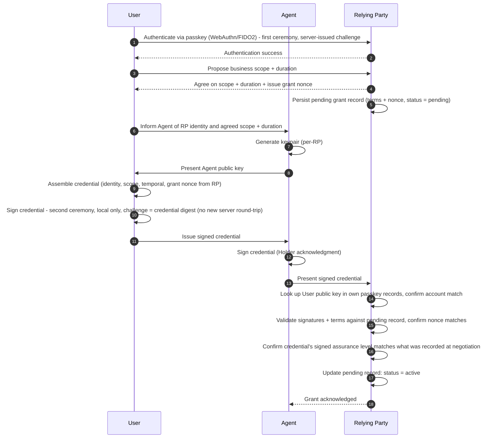
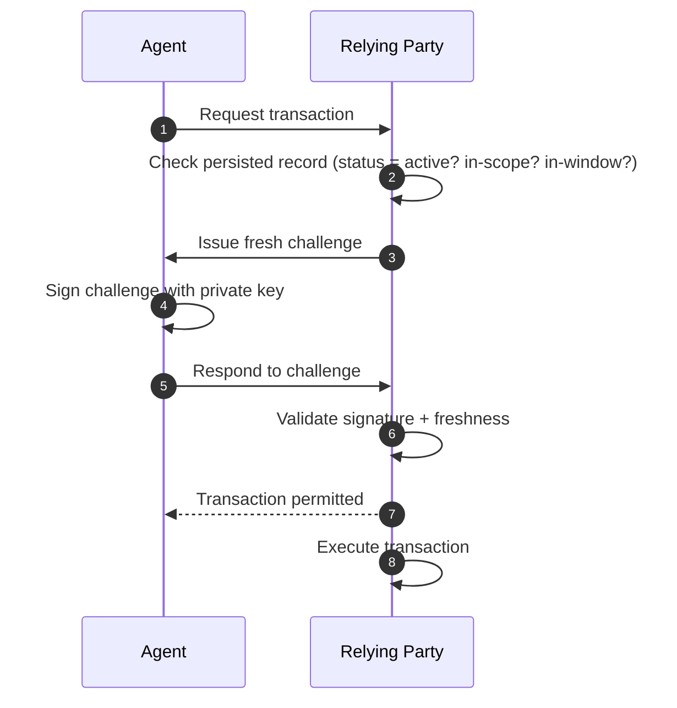
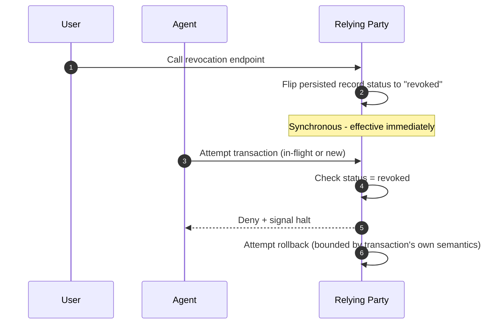

# Temporal Agent Credential (TAC)

**A proposal for AATWG**
**Status:** Draft for discussion — not yet a formal specification
**Date:** June 2026

---

## 1. Problem Statement

AI agents increasingly act on behalf of users to complete tasks with relying parties (RPs) — booking travel, managing subscriptions, executing transactions. Today's authentication model (passkeys) is built on an assumption that doesn't hold for agents: that a human is physically present and consciously approving each authentication event.

If agents are allowed to invoke passkey ceremonies directly, or if "agent passkeys" are introduced without care, the core value of passkeys — phishing resistance and proof of human intent — is at risk of being diluted across the ecosystem.

This proposal separates two questions that are often conflated:

1. **Can we prove a human authorized an agent to act, at a specific point in time, with specific intent?** (human-in-the-loop / authentication)
2. **How does the agent carry and exercise that authorization afterward, within agreed boundaries?** (delegation / authorization)

TAC addresses (1) using a passkey-anchored Verifiable Credential, and explicitly defers (2) to existing delegation patterns (e.g., OAuth), consistent with the AATWG charter's position that delegation is out of scope for this group.

---

## 2. Core Idea

TAC borrows the Verifiable Credential (VC) trust triangle:

| VC Role | Mapped to |
|---|---|
| **Issuer** | User |
| **Holder** | Agent |
| **Verifier** | Relying Party (RP) |

The User, having authenticated to the RP via passkey, issues a **temporal, RP-scoped Verifiable Credential** to the Agent. This credential is the cryptographic record of: *who* authorized *what*, for *how long*, on *whose* behalf. The Agent presents this credential — plus a live challenge-response using its own keypair — when transacting with the RP.

Passkey authentication anchors human presence and intent **at grant time**. The credential and live key carry that authorization **afterward**, without requiring repeated human re-verification, as long as activity stays within agreed bounds.

**Critically, the scope of business the RP is willing to agree to is bound to the assurance level of the passkey used at grant time.** A higher-assurance authentication (e.g., platform authenticator with strong user verification) may justify a broader or longer-duration grant; a lower-assurance authentication may limit the RP to a narrower scope or shorter window. This ties the credential's authority directly back to the strength of the original human-presence proof, rather than treating all passkey authentications as interchangeable.

**TAC uses two WebAuthn ceremonies, but only one network round-trip for challenge issuance.** The User authenticates to the RP first — a standard WebAuthn ceremony, with the RP issuing a server challenge as usual. Because the RP now knows exactly who it's talking to, the scope and duration that follow are negotiated and agreed for that specific account from the start, which is what makes the assurance-level-bound scope guarantee actually mean something. As part of that same response, the RP also issues a grant-time nonce. That nonce is later embedded in the assembled credential, which becomes the challenge for the **second** WebAuthn ceremony — the one that signs the credential. Because the nonce's freshness was already established in the first round-trip, the second ceremony doesn't need its own server round-trip to fetch a new challenge: the device performs the signing ceremony locally, using the credential digest (with the embedded nonce) as the challenge. The User still proves presence twice — once to authenticate, once to sign — but only one of those two ceremonies requires a fresh network exchange with the RP beforehand.

**This means the RP must hold short-lived state for a pending, not-yet-signed grant.** A record is persisted as soon as the nonce is issued, with status `pending`; it transitions to `active` only once the second ceremony's signed credential is presented and validated against it. The nonce issued in the first ceremony must have a short, bounded validity window (proposed default: a small number of minutes, well short of the credential's own `validFrom`/`validUntil` window) — if the second ceremony doesn't complete within that window, the pending grant expires and the nonce is no longer redeemable. This bounds how long the RP needs to retain pending-negotiation state, and prevents a nonce issued at authentication time from being usable arbitrarily far in the future.

---

## 3. Roles and Keys

- **User**: authenticates to the RP via a standard WebAuthn ceremony first — this confirms the account before scope and duration are negotiated. A second WebAuthn ceremony, using a nonce issued during the first, signs the assembled credential without requiring its own server round-trip. **The User's public key in the credential is the same passkey public key already on file with the RP from prior registration.** This is what lets the RP tie a presented credential back to a specific account: it looks up the User public key from the credential and checks it against its own passkey-registration record before proceeding with the rest of the validation ceremony. **Precondition: this assumes the User already has an established passkey relationship with the RP.** First-time passkey enrollment is out of scope for TAC, consistent with the WG's existing position that onboarding is a separate concern.
- **Agent**: generates its own keypair locally. Private key never leaves the agent. **Default: one keypair per RP** (avoids cross-RP correlation risk). A per-credential keypair is available as an optional stronger-privacy variant.
- **RP**: known to the user via existing passkey relationship. Acts as VC Verifier and persists the issued credential's terms for later validation, audit, and revocation checking.

---

## 4. The Credential

A temporal Verifiable Credential issued by the User to the Agent's public key, containing (at concept level — exact schema TBD):

- **Identity block**: User public key (the User's registered passkey public key — not a separate signing key), Agent public key, RP identifier. Because the Agent's public key is part of the content the User signs, the User's signature itself cryptographically binds this credential to that specific Agent identity: substituting a different Agent public key after the User signs would change the signed content and invalidate the User's signature when the RP recomputes the credential digest at grant completion.
- **Scope block**: agreed business/transaction boundaries (deterministic — must be checkable by RP as in-scope/out-of-scope without ambiguity). **The boundaries the RP is willing to agree to are a function of the assurance level of the passkey used at grant time** — not a fixed or RP-arbitrary scope.
- **Temporal block**: `validFrom` / `validUntil` (standard VC claims — no new time semantics needed)
- **Integrity block**: grant-time nonce (issued by the RP during the first, authenticating ceremony; embedded in the credential digest and reused as the challenge for the second, signing ceremony — this is what lets the second ceremony skip its own server round-trip while still being cryptographically fresh), User's signature over the credential. **This signature is produced via a standard WebAuthn assertion ceremony** — the credential's contents (including the RP-issued nonce) are presented to the authenticator as the WebAuthn challenge, and the passkey signs that challenge through the existing WebAuthn signing flow. TAC deliberately does not ask passkeys to sign arbitrary documents outside their normal WebAuthn-shaped operation; it reuses the existing mechanism rather than introducing a new one.

The credential must also include the assurance level achieved at grant time as a signed field — covered by the User's signature alongside the identity, scope, and temporal blocks. This makes the credential itself the auditable record of "this scope was justified by this assurance level at the time of grant," rather than relying solely on the RP's internal negotiation log. Without this, the proposal's core claim that scope is bound to assurance level has no tamper-evident mechanism in the issued artifact.

This is deliberately a **lightweight, RP-local credential** — not designed for long-lived, multi-verifier use. It is issued for one user, one agent identity, one RP, one window. No cross-RP credential reuse.

---

## 5. Revocation

Given the credential is short-lived and single-verifier (one RP), we deliberately avoid heavyweight VC revocation infrastructure (e.g., global status lists), which is built for long-lived, widely-verified credentials. Instead:

- RP persists the credential's terms server-side at issuance.
- User-initiated revocation hits an RP-provided endpoint, authenticated the same way as the original grant — by the User's passkey-bound identity; the persisted record's status flips immediately. The challenge issued for this authentication must be bound to the specific credential being revoked — not a general-purpose presence proof. A captured revocation assertion scoped to credential A must not be replayable to revoke an unrelated credential B held by the same user at the same RP.
- RP checks revocation status **synchronously** on every transaction attempt — no propagation delay.
- Revocation signals the RP to halt future use immediately, and to attempt rollback of any in-flight transaction. **Rollback success is bounded by the RP's own transaction semantics** (e.g., a cancellable booking vs. an already-settled transfer) — TAC guarantees the halt signal, not the rollback outcome.
- Design principle: the human must remain in the loop for **exceptions** — out-of-scope attempts, expired window, or anomalies — not for every routine in-scope transaction.

Amendment (changing scope or window mid-flight) is currently treated as **revoke + re-grant**, not a separate operation. This is a known simplification, open to revisiting once the core mechanism is agreed.

---

## 6. Replay Protection (Two Distinct Layers)

It's important these are not conflated:

1. **Grant-time nonce** (in the credential): prevents the issuance/signing ceremony itself from being replayed to mint a second valid grant.
2. **Session/transaction-time freshness**: at each actual transaction, the RP issues a fresh challenge; the Agent responds using its private key (challenge-response, structurally similar to WebAuthn's mechanics but **not** a passkey — there is no human presence at this step, by design).

In both cases, a single-use artifact (nonce or challenge) must be consumed — marked as used and rejected for any future presentation — at the moment it is retrieved for verification, before any other check runs. An implementation that consumes the artifact only on successful verification leaves it usable for a second attempt within its validity window if any downstream check (signature validation, scope check, account lookup) fails. This ordering is a mechanism requirement, not an implementation detail.

The credential is presented once at enrollment; every subsequent transaction requires live proof-of-possession of the agent's private key against a fresh challenge.

---

## 7. Sequence Diagram: Grant (Issuance)

**Precondition:** the User already has a registered passkey relationship with the RP (first-time enrollment is out of scope).

**Note:** this is the happy path. Any failure — account lookup miss, invalid signature, nonce mismatch, expired pending-grant window, or terms mismatch — aborts the grant; no record is persisted. The credential handoff from User to Agent does not require a confidential channel: possession of the credential alone, without the Agent's private key, cannot be used to act on it.

---

## 8. Sequence Diagram: Transaction (Use)

---

## 9. Sequence Diagram: Revocation

---

## 10. Key Design Choices and Trade-offs

| Choice | Alternative considered | Why this choice |
|---|---|---|
| Two WebAuthn ceremonies, but one network round-trip (nonce reused from first ceremony) | One combined ceremony (auth + sign together) | A single ceremony would force scope agreement to happen before the RP knows who it's talking to, making it provisional rather than real; two ceremonies preserve account-specific, assurance-bound scope agreement while still avoiding a second round-trip to fetch a fresh challenge |
| Bounded pending-grant window (nonce expires quickly if not redeemed) | Unbounded nonce validity until the credential's own `validFrom`/`validUntil` | Keeps RP-side pending-negotiation state short-lived and bounds how long a nonce issued at authentication time remains usable, independent of the credential's later, separate validity window |
| User signs credential via standard WebAuthn assertion ceremony | A new, separate user-signing mechanism outside WebAuthn | Reuses the existing passkey mechanism rather than inventing parallel crypto; keeps the User's signature tied to the same authenticator/secure-enclave guarantees passkeys already provide |
| Agent generates own keypair | RP generates keypair for agent | Avoids private key custody/transit risk; matches passkey precedent of subject-held keys |
| One Agent keypair per RP (default) | Single Agent keypair reused across RPs | Prevents cross-RP correlation of agent activity; reuse is offered as an opt-in for those who accept the trade-off, with stronger unlinkability (e.g., BBS+) as a future option |
| Lightweight, RP-local revocation | Full VC status-list/registry infrastructure | Credential is short-lived and single-verifier; heavyweight global revocation is disproportionate to the risk and cost |
| Standard `validFrom`/`validUntil` | Custom temporal claim type | Fits existing VC tooling; no identified need beyond standard expiry semantics |
| Amendment = revoke + re-grant | In-place amendment protocol | Keeps v1 scope tractable; revisit once core mechanism is validated |
| Session freshness via separate challenge-response | Rely solely on grant-time credential as ongoing proof | Prevents the issued credential from becoming a static bearer credential; closes replay risk without requiring repeated human involvement |

---

## 11. Relationship to OAuth / Delegation

TAC is **not** a delegation/authorization protocol and does not compete with OAuth. It is the **human-presence-and-intent attestation layer** that can sit underneath or alongside an OAuth-style authorization grant — supplying a standard way to prove "a human authorized this agent, with this scope, for this duration" that OAuth flows don't currently carry natively. Actual authorization mechanics (token issuance, API access patterns) remain OAuth's domain, consistent with the AATWG charter.

---

## 12. Explicit Boundaries (What This Proposal Does NOT Cover)

- Initial agent onboarding / enrollment (out of scope per WG charter discussion — this addresses authentication-time use, not onboarding)
- Multi-RP or multi-agent identity federation — one grant = one User identity = one Agent identity = one RP = one window, no reuse beyond what's stated above
- In-place amendment of an active grant
- Guaranteed rollback of already-settled transactions — TAC signals halt/rollback intent; outcome depends on RP's own transaction semantics
- Assurance of RP-side honesty about the detected authenticator assurance level — the signed credential (with assurance level included as a signed field per Section 4) prevents a user-side client from inflating the claimed assurance level, but does not protect against an RP itself misreporting what it detected during the first ceremony. That threat requires RP-side attestation or audit mechanisms, which are outside the scope of TAC.

---

## 13. Open Questions for the Group

Ranked from most architecturally consequential to most tunable, to help focus discussion time on what matters most first.

1. **Exact mechanics of presenting the credential's contents as a WebAuthn challenge** — does this require a new WebAuthn extension, or can existing assertion options (e.g., challenge field semantics) carry a credential digest without modification to the WebAuthn ceremony itself? *Foundational — if this doesn't work within existing WebAuthn semantics, the signing mechanism needs rework.*
2. **How the mapping from passkey assurance level to allowable scope is determined** — left entirely to RP/User negotiation per grant, or does it need a more defined policy structure (e.g., a reference table of assurance level to permissible scope/duration)? *This is TAC's core differentiator; without a defined mechanism, the assurance-bound scope claim is a principle without machinery.*
3. **Confirm "Temporal Agent Credential" framing avoids any implication of delegation**, consistent with delegation being out of scope for the WG charter. *Positioning risk — affects whether the substance gets a fair hearing.*
4. **Exact scope-block expressiveness needed** (transaction types, amount limits, both?) — deferred until concept is validated.
5. **Should the Agent receive scope/duration informally at step 5, or remain blind to those terms until the signed credential is delivered at step 10?** Sharing early allows the Agent to fail fast if the negotiated scope won't suit its task; withholding it is a stricter minimal-disclosure posture, since nothing reaches the Agent except what's cryptographically final.
6. **Whether per-credential (vs. per-RP) Agent keys should be a recommended option or purely opt-in.**
7. **Whether "exception" conditions requiring human-in-the-loop should be standardized across implementations or left to RP discretion.** An exception is a transaction attempt that falls outside what was routinely agreed — for example, the Agent requesting something out of scope, the credential's time window having expired, or the RP detecting an anomaly (e.g., an unusual pattern compared to the agreed terms). Should TAC define a fixed list of what counts as an exception across all implementations, or should each RP define its own based on its risk profile?
8. **What's a reasonable default for the pending-grant nonce window** (time between the first ceremony issuing the nonce and the second ceremony redeeming it) — fixed by the spec, or left to RP policy?

---

## 14. Proposed Next Steps

1. Circulate this proposal to AATWG chairs for review.
2. Request a 2-minute pitch slot at the next meeting (June 30, 2026).
3. If there's interest, prototype in the GitHub playground proposed at the June 16 meeting.
